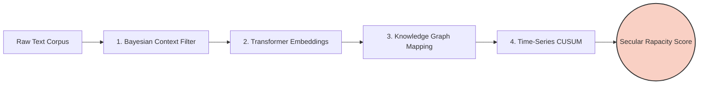

# 🦅 Secular Rapacity Detection (SRD)

> **A computational mathematics and NLP framework for detecting systemic, long-term extractive behavior in text corpora.**

[](https://www.python.org/downloads/)
[](https://opensource.org/licenses/MIT)
[](https://arxiv.org/)

## 📖 Overview

**"Secular Rapacity"** is operationalized in this framework as aggressively greedy, extractive, or predatory behavior that is either **systemic/non-religious** (e.g., corporate/economic extraction) or represents a **long-term, non-cyclical trend**. 

This repository provides the mathematical foundations, algorithms, and pipeline architecture to detect, quantify, and track secular rapacity in large-scale text corpora using advanced computational mathematics.

---

## 🏗️ System Architecture



---

## 🧮 Mathematical Foundations

The SRD pipeline relies on five core mathematical pillars. 

### 1. Semantic Quantification (Linear Algebra & Topology)
To detect rapacity, we map the semantic space of greed and extraction into high-dimensional vector spaces ($\mathbb{R}^d$).

*   **Cosine Similarity:** Measures the geometric alignment between a document vector and a "rapacity seed vector":
    $$ \cos(\theta) = \frac{\mathbf{A} \cdot \mathbf{B}}{\|\mathbf{A}\| \|\mathbf{B}\|} = \frac{\sum_{i=1}^{d} A_i B_i}{\sqrt{\sum_{i=1}^{d} A_i^2} \sqrt{\sum_{i=1}^{d} B_i^2}} $$
*   **Transformer Self-Attention:** Contextualizes extractive actions (e.g., distinguishing market extraction from dental extraction) via scaled dot-product attention:
    $$ \text{Attention}(Q, K, V) = \text{softmax}\left(\frac{QK^\top}{\sqrt{d_k}}\right)V $$

### 2. Context Isolation (Probability & Bayesian Inference)
To ensure we are measuring *systemic/secular* rapacity rather than moral or interpersonal greed, we use **Latent Dirichlet Allocation (LDA)** to isolate the economic/systemic topic cluster.

*   **Generative Mathematics:** The joint probability of a document $d$ and word $w$ is modeled as:
    $$ P(w, z | \alpha, \beta) = P(w | z, \beta) P(z | d, \alpha) $$
    *(Where $z$ is the topic assignment, and $\alpha, \beta$ are Dirichlet priors).*
*   **Variational Inference:** Maximizes the Evidence Lower Bound (ELBO) to make exact inference computationally tractable.

### 3. Trend Detection (Stochastic Time-Series)
To prove the detected rapacity is a "secular" (long-term) trend rather than a cyclical fluctuation, we apply time-series mathematics to the semantic outputs.

*   **CUSUM Change-Point Detection:** Flags the exact moment a secular shift toward rapacity begins:
    $$ S_t = \max(0, S_{t-1} + X_t - \mu_0 - k) $$
    *(Where $S_t$ is the cumulative sum, $\mu_0$ is the historical baseline, and $k$ is a slack parameter. A shift is flagged if $S_t > h$).*
*   **ARIMA Differencing:** Applies differencing ($d$) to make the time-series stationary, mathematically stripping away short-term seasonal noise.

### 4. Actor Mapping (Graph Theory & Matrix Factorization)
Rapacity implies a directed relationship: an *actor* extracting from a *victim/resource*. We model this using directed Knowledge Graphs $G = (V, E)$.

*   **Eigenvector Centrality:** Identifies the most "rapacious" systemic actors by calculating the principal eigenvalue $\lambda$ of the adjacency matrix $A$:
    $$ \mathbf{A}\mathbf{x} = \lambda \mathbf{x} $$
    High eigenvector centrality in an extractive graph mathematically isolates the primary predators.

### 5. Systemic Shift Measurement (Information Theory)
To quantify how the *overall distribution* of language in a corpus is shifting toward secular rapacity over decades.

*   **Kullback-Leibler (KL) Divergence:** Measures the information shift from a historical baseline distribution ($Q$) to a modern distribution ($P$):
    $$ D_{\text{KL}}(P \parallel Q) = \sum_{x \in \mathcal{X}} P(x) \log \left( \frac{P(x)}{Q(x)} \right) $$
*   **Jensen-Shannon (JS) Divergence:** Used as a symmetric alternative to KL to track the convergence of text distributions over time.

---

## 🚀 Quick Start

### Installation

```bash
# Clone the repository
git clone https://github.com/yourusername/secular-rapacity-detection.git
cd secular-rapacity-detection

# Install dependencies
pip install -r requirements.txt
```

### Usage Example

```python
from srd import SecularRapacityDetector
from srd.graph import ExtractiveKnowledgeGraph
from srd.timeseries import CUSUMTrendAnalyzer

# 1. Initialize the detector with a corpus
detector = SecularRapacityDetector(
    model="roberta-large", 
    lda_topics=50, 
    context_filter="systemic_economic"
)

# 2. Fit the model on historical and modern corpora
detector.fit(historical_corpus, modern_corpus)

# 3. Extract the knowledge graph of actors and resources
graph = ExtractiveKnowledgeGraph(detector.embeddings)
top_predators = graph.get_eigenvector_centrality(top_n=10)

# 4. Run CUSUM to find the exact year the secular trend shifted
analyzer = CUSUMTrendAnalyzer(detector.rapacity_scores)
shift_year, confidence = analyzer.detect_change_point()

print(f"Secular rapacity shift detected in {shift_year} (Confidence: {confidence:.2f})")
print(f"Primary extractive actors: {top_predators}")
```

---

## 📂 Project Structure

```text
secular-rapacity-detection/
├── srd/
│   ├── __init__.py
│   ├── embeddings.py       # Linear algebra & Transformer attention math
│   ├── bayesian.py         # LDA & Variational Inference for context
│   ├── timeseries.py       # CUSUM & ARIMA for secular trend detection
│   ├── graph.py            # Adjacency matrices & Eigenvector centrality
│   └── information.py      # KL & JS Divergence calculations
├── tests/
├── notebooks/              # Jupyter notebooks with mathematical proofs
├── requirements.txt
└── README.md
```

---

## 🤝 Contributing

Contributions, issues, and feature requests are welcome! 
If you want to add new mathematical formulations for detecting extractive semantics, please open a Pull Request.

1. Fork it (`gh repo fork yourusername/secular-rapacity-detection`)
2. Create your feature branch (`git checkout -b feature/NewMathModule`)
3. Commit your changes (`git commit -m 'Add new mathematical module'`)
4. Push to the branch (`git push origin feature/NewMathModule`)
5. Open a Pull Request

---

## 📜 License

Distributed under the MIT License. See [`LICENSE`](LICENSE) for more information.

---

## 📚 Citation

If you use this framework in your research, please cite:

```bibtex
@software{secular_rapacity_2026,
  title  = {Secular Rapacity Detection: A Computational Mathematics Framework},
  author = {Your Name/Organization},
  year   = {2026},
  url    = {https://github.com/yourusername/secular-rapacity-detection}
}
```
